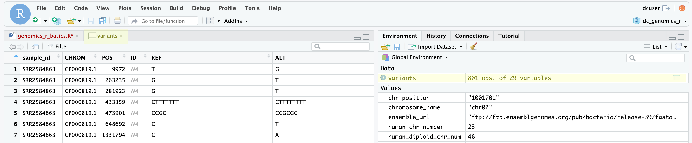
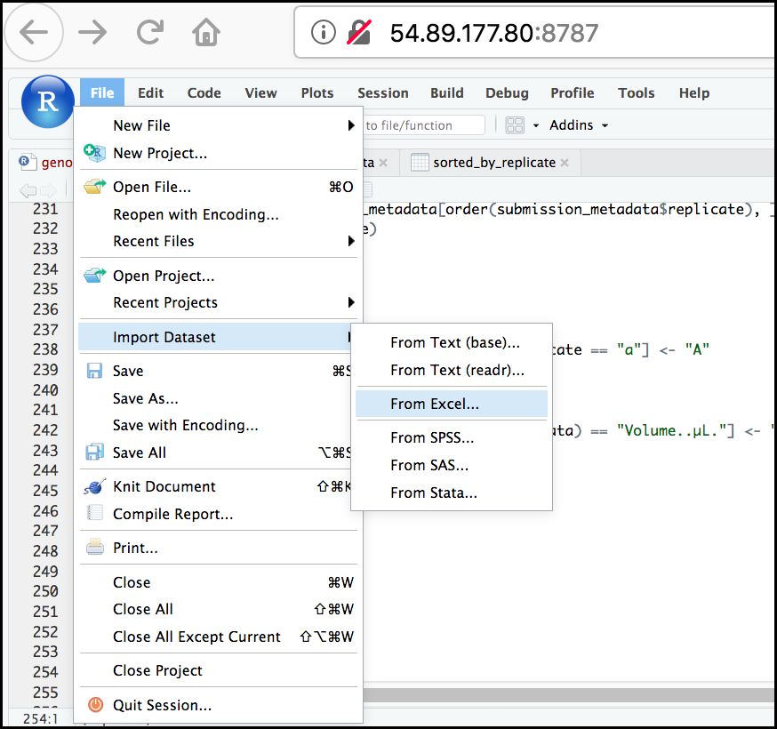
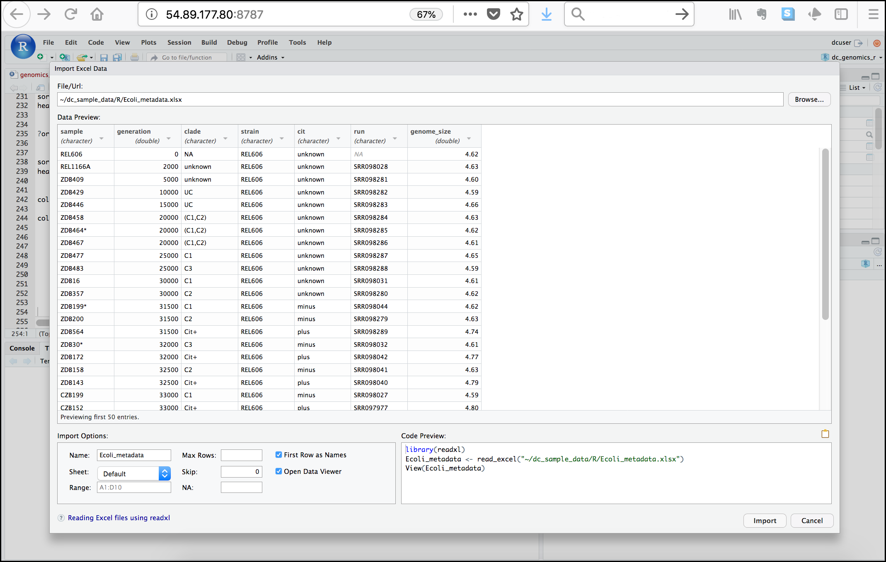

# R Basics continued - data frames and manipulation 


!!! info "Learning outcomes"

    === "Key points"
    
        - It is easy to import data into R from tabular formats including Excel.
          However, you still need to check that R has imported and interpreted
          your data correctly
        - There are best practices for organising your data (keeping it tidy)
          and R is great for this
        - Base R has many useful functions for manipulating your data, but all
          of R's capabilities are greatly enhanced by software packages
          developed by the community

    === "Objectives"
 
        - Understand the basic principle of tidy datasets
        - Be able to load a tabular dataset using base R functions
        - Be able to determine the structure of a data frame including its
          dimensions and the datatypes of variables
        - Be able to subset/retrieve values from a data frame
        - Be able to change the mode of an object
        - Be able to apply an arithmetic function to a data frame
        - Be able to import data from Excel
        - Be able to save a data frame as a delimited file
    
    === "Questions"
 
        - How do I get started with tabular data (e.g., spreadsheets) in R?
        - What are some best practices for reading data into R?
        - How do I save tabular data generated in R?


## Working with spreadsheets (tabular data)

A substantial amount of the data we work with in genomics will be
tabular data, this is data arranged in rows and columns - also known as
spreadsheets. We could write a whole lesson on how to work with
spreadsheets effectively ([actually the Carpentries
did](https://datacarpentry.org/organization-genomics/)). For our
purposes, we want to remind you of a few principles before we work with
our first set of example data:

**1) Keep raw data separate from analysed data**

This is principle number one because if you can't tell which files are
the original raw data, you risk making some serious mistakes
(e.g., drawing conclusion from data which have been manipulated in some
unknown way).

**2) Keep spreadsheet data Tidy**

The simplest principle of **Tidy data** is that we have one row in our
spreadsheet for each observation or sample, and one column for every
variable that we measure or report on. As simple as this sounds, it's
very easily violated. Most data scientists agree that significant
amounts of their time is spent tidying data for analysis. Read more
about data sation in [this Carpentries
lesson](https://datacarpentry.org/organization-genomics/) and in [this
paper](https://www.jstatsoft.org/article/view/v059i10).

**3) Trust but verify**

Finally, while you don't need to be paranoid about data, you should have
a plan for how you will prepare it for analysis. **This a focus of this
lesson.** You probably already have a lot of intuition, expectations,
assumptions about your data - the range of values you expect, how many
values should have been recorded, etc. Of course, as the data get larger
our human ability to keep track will start to fail (and yes, it can fail
for small data sets too). R will help you to examine your data so that
you can have greater confidence in your analysis and its
reproducibility.

!!! tip "Keeping your raw data separate"

    When you work with data in R, you are not changing the original file
    you loaded that data from. This is different from (for example)
    working with a spreadsheet program where changing the value of the
    cell leaves you one "save"-click away from overwriting the original
    file. You have to purposely use a writing function
    (e.g., `write.csv()`) to save data loaded into R. In that case, be sure
    to save the manipulated data into a new file. More on this later in
    the lesson.

### Importing tabular data into R

There are several ways to import data into R. For our purpose here, we
will focus on using the tools every R installation comes with (so called
"base" R) to import a comma-delimited file containing the results of our
variant calling workflow. We will need to load the sheet using a
function called `read.csv()`.


Now, let's read in the file `combined_tidy_vcf.csv` which will be
located in `/home/shared/$USER/R4Genomics/`. Call/assign this data `variants`. 
The first argument to pass to our `read.csv()` function is the file path for our
data. The file path must be in quotes and now is a good time to remember
to use tab autocompletion. **If you use tab autocompletion you avoid
typos and errors in file paths.** Use it!

!!! r-project "r"

    ```r
    # Read in a CSV file and save it as 'variants'

    variants <- read.csv("/home/shared/<USERID>/R4Genomics/combined_tidy_vcf.csv")
    ```

    ??? tip "What if you want to access this file on your personal computer?"
        ```r
        # Read the csv directly from our github repository

        variants <- read.csv("https://raw.githubusercontent.com/GenomicsAotearoa/Introduction-to-R/refs/heads/main/combined_tidy_vcf.csv")
        ```

One of the first things you should notice is that in the Environment
window, you have the `variants` object, listed as 801 obs.
(observations/rows) of 29 variables (columns). Double-clicking on the
name of the object will open a view of the data in a new tab.

{ width="1000" }

### Summarising and determining the structure of a data frame.

A **data frame is the standard way to store tabular data in R**. A data
frame could also be thought of as a collection of vectors, all of which
have the same length. Using only two functions, we can learn a lot about
out data frame including some summary statistics as well as the
"structure" of the data frame. Let's examine what each of these
functions can tell us:

!!! r-project "r"

    ```r
    # Get structure of a dataframe

    str(variants)
    ```

    ??? success "Output"

        ```
        'data.frame':	801 obs. of  29 variables:
        $ sample_id    : chr  "SRR2584863" "SRR2584863" "SRR2584863" "SRR2584863" ...
        $ CHROM        : chr  "CP000819.1" "CP000819.1" "CP000819.1" "CP000819.1" ...
        $ POS          : int  9972 263235 281923 433359 473901 648692 1331794 1733343 2103887 2333538 ...
        $ ID           : logi  NA NA NA NA NA NA ...
        $ REF          : chr  "T" "G" "G" "CTTTTTTT" ...
        $ ALT          : chr  "G" "T" "T" "CTTTTTTTT" ...
        $ QUAL         : num  91 85 217 64 228 210 178 225 56 167 ...
        $ FILTER       : logi  NA NA NA NA NA NA ...
        $ INDEL        : logi  FALSE FALSE FALSE TRUE TRUE FALSE ...
        $ IDV          : int  NA NA NA 12 9 NA NA NA 2 7 ...
        $ IMF          : num  NA NA NA 1 0.9 ...
        $ DP           : int  4 6 10 12 10 10 8 11 3 7 ...
        $ VDB          : num  0.0257 0.0961 0.7741 0.4777 0.6595 ...
        $ RPB          : num  NA 1 NA NA NA NA NA NA NA NA ...
        $ MQB          : num  NA 1 NA NA NA NA NA NA NA NA ...
        $ BQB          : num  NA 1 NA NA NA NA NA NA NA NA ...
        $ MQSB         : num  NA NA 0.975 1 0.916 ...
        $ SGB          : num  -0.556 -0.591 -0.662 -0.676 -0.662 ...
        $ MQ0F         : num  0 0.167 0 0 0 ...
        $ ICB          : logi  NA NA NA NA NA NA ...
        $ HOB          : logi  NA NA NA NA NA NA ...
        $ AC           : int  1 1 1 1 1 1 1 1 1 1 ...
         $ AN           : int  1 1 1 1 1 1 1 1 1 1 ...
        $ DP4          : chr  "0,0,0,4" "0,1,0,5" "0,0,4,5" "0,1,3,8" ...
        $ MQ           : int  60 33 60 60 60 60 60 60 60 60 ...
        $ Indiv        : chr  "/home/dcuser/dc_workshop/results/bam/SRR2584863.aligned.sorted.bam" "/home/dcuser/dc_workshop/results/bam/SRR2584863.aligned.sorted.bam" "/home/dcuser/dc_workshop/results/bam/SRR2584863.aligned.sorted.bam" "/home/dcuser/dc_workshop/results/bam/SRR2584863.aligned.sorted.bam" ...
        $ gt_PL        : chr  "121,0" "112,0" "247,0" "91,0" ...
        $ gt_GT        : int  1 1 1 1 1 1 1 1 1 1 ...
        $ gt_GT_alleles: chr  "G" "T" "T" "CTTTTTTTT" ...

        ```

Ok, that is a lot up unpack! Some things to notice.

- The object type `data.frame` is displayed in the first row along with its
  dimensions, in this case 801 observations (rows) and 29 variables (columns).
- Each variable (column) has a name (e.g., `sample_id`). This is followed
  by the object mode (e.g., chr, int, etc.). Notice that before each
  variable name there is a `$` (this will be important later).


Now let's look at some summary statistics for our dataframe:

!!! r-project "r"

    ```r
    # Get summary statistics on a data frame

    summary(variants)
    ```

    ??? success "Output"

        ```
         sample_id            CHROM                POS             ID              REF           
        Length:801         Length:801         Min.   :   1521   Mode:logical   Length:801        
        Class :character   Class :character   1st Qu.:1115970   NA's:801       Class :character  
        Mode  :character   Mode  :character   Median :2290361                  Mode  :character  
                                              Mean   :2243682                                    
                                              3rd Qu.:3317082                                    
                                              Max.   :4629225                                    

            ALT                 QUAL          FILTER          INDEL              IDV              IMF        
        Length:801         Min.   :  4.385   Mode:logical   Mode :logical   Min.   : 2.000   Min.   :0.5714  
        Class :character   1st Qu.:139.000   NA's:801       FALSE:700       1st Qu.: 7.000   1st Qu.:0.8824  
        Mode  :character   Median :195.000                  TRUE :101       Median : 9.000   Median :1.0000  
                           Mean   :172.276                                  Mean   : 9.396   Mean   :0.9219  
                           3rd Qu.:225.000                                  3rd Qu.:11.000   3rd Qu.:1.0000  
                           Max.   :228.000                                  Max.   :20.000   Max.   :1.0000  
                                                                            NA's   :700      NA's   :700     
              DP             VDB                 RPB              MQB              BQB        
        Min.   : 2.00   Min.   :0.0005387   Min.   :0.0000   Min.   :0.0000   Min.   :0.1153  
        1st Qu.: 7.00   1st Qu.:0.2180410   1st Qu.:0.3776   1st Qu.:0.1070   1st Qu.:0.6963  
        Median :10.00   Median :0.4827410   Median :0.8663   Median :0.2872   Median :0.8615  
        Mean   :10.57   Mean   :0.4926291   Mean   :0.6970   Mean   :0.5330   Mean   :0.7784  
        3rd Qu.:13.00   3rd Qu.:0.7598940   3rd Qu.:1.0000   3rd Qu.:1.0000   3rd Qu.:1.0000  
        Max.   :79.00   Max.   :0.9997130   Max.   :1.0000   Max.   :1.0000   Max.   :1.0000  
                                            NA's   :773      NA's   :773      NA's   :773     
             MQSB              SGB               MQ0F           ICB            HOB                AC   
        Min.   :0.01348   Min.   :-0.6931   Min.   :0.00000   Mode:logical   Mode:logical   Min.   :1  
        1st Qu.:0.95494   1st Qu.:-0.6762   1st Qu.:0.00000   NA's:801       NA's:801       1st Qu.:1  
        Median :1.00000   Median :-0.6620   Median :0.00000                                 Median :1  
        Mean   :0.96428   Mean   :-0.6444   Mean   :0.01127                                 Mean   :1  
        3rd Qu.:1.00000   3rd Qu.:-0.6364   3rd Qu.:0.00000                                 3rd Qu.:1  
        Max.   :1.01283   Max.   :-0.4536   Max.   :0.66667                                 Max.   :1  
        NA's   :48                                                                                     
              AN        DP4                  MQ           Indiv              gt_PL               gt_GT  
        Min.   :1   Length:801         Min.   :10.00   Length:801         Length:801         Min.   :1  
        1st Qu.:1   Class :character   1st Qu.:60.00   Class :character   Class :character   1st Qu.:1  
        Median :1   Mode  :character   Median :60.00   Mode  :character   Mode  :character   Median :1  
        Mean   :1                      Mean   :58.19                                         Mean   :1  
        3rd Qu.:1                      3rd Qu.:60.00                                         3rd Qu.:1  
        Max.   :1                      Max.   :60.00                                         Max.   :1  

        gt_GT_alleles     
        Length:801        
        Class :character  
        Mode  :character
        ```

Our data frame has 29 variables, so we get 29 fields that summarise the data.
The `QUAL`, `IMF`, and `VDB` variables (and several others) are
numerical data and so you get summary statistics on the minimum and maximum 
values for these columns, as well as mean, median, and 1st and 3rd quantile. 
Many of the other variables (e.g., `sample_id`) are treated as character data 
(more on this in a bit). 

### Subsetting data frames

Next, we are going to talk about how you can get specific values from
data frames.

The first thing to remember is that a data frame is two-dimensional
(rows and columns). Therefore, to select a specific value we will will
once again use `[]` (bracket) notation, but we will specify more than
one value (except in some cases where we are taking a range).

!!! question "Exercise: Subsetting a data frame"
    **Try the following indices and functions and try to figure out what
    they return**

    a.  `variants[1, 1]`

    b.  `variants[2, 4]`

    c.  `variants[801, 29]`

    d.  `variants[2,]`
    
    e.  `variants[-1,]`
    
    f.  `variants[1:4, 1]`
    
    g.  `variants[1:10, c("REF","ALT")]`
    
    h.  `variants[, c("sample_id")]`
    
    i.  `head(variants)`
    
    j.  `tail(variants)`
    
    k.  `variants$sample_id`
    
    l.  `variants[variants$REF == "A",]`

    ??? success "Output"

        a.
        ```
        [1] "SRR2584863"
        ```

        b.
        ```
        [1] NA
        ```

        c.
        ```
        [1] "T"
        ```

        d.
        ```
            sample_id      CHROM    POS ID REF ALT QUAL FILTER INDEL IDV IMF DP      VDB RPB MQB BQB
        2  SRR2584863 CP000819.1 263235 NA   G   T   85     NA FALSE  NA  NA  6 0.096133   1   1   1
            MQSB       SGB     MQ0F ICB HOB AC AN     DP4 MQ
        2     NA -0.590765 0.166667  NA  NA  1  1 0,1,0,5 33
                                                                       Indiv gt_PL gt_GT gt_GT_alleles
        2 /home/dcuser/dc_workshop/results/bam/SRR2584863.aligned.sorted.bam 112,0     1             T
        ```

        e.
        ```
           sample_id      CHROM     POS ID      REF       ALT QUAL FILTER INDEL IDV IMF
        2 SRR2584863 CP000819.1  263235 NA        G         T   85     NA FALSE  NA  NA
        3 SRR2584863 CP000819.1  281923 NA        G         T  217     NA FALSE  NA  NA
        4 SRR2584863 CP000819.1  433359 NA CTTTTTTT CTTTTTTTT   64     NA  TRUE  12 1.0
        5 SRR2584863 CP000819.1  473901 NA     CCGC    CCGCGC  228     NA  TRUE   9 0.9
        6 SRR2584863 CP000819.1  648692 NA        C         T  210     NA FALSE  NA  NA
        7 SRR2584863 CP000819.1 1331794 NA        C         A  178     NA FALSE  NA  NA
          DP      VDB RPB MQB BQB     MQSB       SGB     MQ0F ICB HOB AC AN     DP4 MQ
        2  6 0.096133   1   1   1       NA -0.590765 0.166667  NA  NA  1  1 0,1,0,5 33
        3 10 0.774083  NA  NA  NA 0.974597 -0.662043 0.000000  NA  NA  1  1 0,0,4,5 60
        4 12 0.477704  NA  NA  NA 1.000000 -0.676189 0.000000  NA  NA  1  1 0,1,3,8 60
        5 10 0.659505  NA  NA  NA 0.916482 -0.662043 0.000000  NA  NA  1  1 1,0,2,7 60
        6 10 0.268014  NA  NA  NA 0.916482 -0.670168 0.000000  NA  NA  1  1 0,0,7,3 60
        7  8 0.624078  NA  NA  NA 0.900802 -0.651104 0.000000  NA  NA  1  1 0,0,3,5 60
                                                                       Indiv gt_PL
        2 /home/dcuser/dc_workshop/results/bam/SRR2584863.aligned.sorted.bam 112,0
        3 /home/dcuser/dc_workshop/results/bam/SRR2584863.aligned.sorted.bam 247,0
        4 /home/dcuser/dc_workshop/results/bam/SRR2584863.aligned.sorted.bam  91,0
        5 /home/dcuser/dc_workshop/results/bam/SRR2584863.aligned.sorted.bam 255,0
        6 /home/dcuser/dc_workshop/results/bam/SRR2584863.aligned.sorted.bam 240,0
        7 /home/dcuser/dc_workshop/results/bam/SRR2584863.aligned.sorted.bam 208,0
          gt_GT gt_GT_alleles
        2     1             T
        3     1             T
        4     1     CTTTTTTTT
        5     1        CCGCGC
        6     1             T
        7     1             A
        ```

        f. 
        ```
        [1] "SRR2584863" "SRR2584863" "SRR2584863" "SRR2584863"
        ```

        g.
        ```
                                        REF
        1                                 T
        2                                 G
        3                                 G
        4                          CTTTTTTT
        5                              CCGC
        6                                 C
        7                                 C
        8                                 G
        9  ACAGCCAGCCAGCCAGCCAGCCAGCCAGCCAG
        10                               AT
                                                                ALT
        1                                                         G
        2                                                         T
        3                                                         T
        4                                                 CTTTTTTTT
        5                                                    CCGCGC
        6                                                         T
        7                                                         A
        8                                                         A
        9  ACAGCCAGCCAGCCAGCCAGCCAGCCAGCCAGCCAGCCAGCCAGCCAGCCAGCCAG
        10                                                      ATT
        ```

        h.
        ```
        [1] "SRR2584863" "SRR2584863" "SRR2584863" "SRR2584863" "SRR2584863"
        [6] "SRR2584863"
        ```

        i.
        ```
           sample_id      CHROM    POS ID      REF       ALT QUAL FILTER INDEL IDV IMF DP       VDB RPB
        1 SRR2584863 CP000819.1   9972 NA        T         G   91     NA FALSE  NA  NA  4 0.0257451  NA
        2 SRR2584863 CP000819.1 263235 NA        G         T   85     NA FALSE  NA  NA  6 0.0961330   1
        3 SRR2584863 CP000819.1 281923 NA        G         T  217     NA FALSE  NA  NA 10 0.7740830  NA
        4 SRR2584863 CP000819.1 433359 NA CTTTTTTT CTTTTTTTT   64     NA  TRUE  12 1.0 12 0.4777040  NA
        5 SRR2584863 CP000819.1 473901 NA     CCGC    CCGCGC  228     NA  TRUE   9 0.9 10 0.6595050  NA
        6 SRR2584863 CP000819.1 648692 NA        C         T  210     NA FALSE  NA  NA 10 0.2680140  NA
          MQB BQB     MQSB       SGB     MQ0F ICB HOB AC AN     DP4 MQ
        1  NA  NA       NA -0.556411 0.000000  NA  NA  1  1 0,0,0,4 60
        2   1   1       NA -0.590765 0.166667  NA  NA  1  1 0,1,0,5 33
        3  NA  NA 0.974597 -0.662043 0.000000  NA  NA  1  1 0,0,4,5 60
        4  NA  NA 1.000000 -0.676189 0.000000  NA  NA  1  1 0,1,3,8 60
        5  NA  NA 0.916482 -0.662043 0.000000  NA  NA  1  1 1,0,2,7 60
        6  NA  NA 0.916482 -0.670168 0.000000  NA  NA  1  1 0,0,7,3 60
                                                                       Indiv gt_PL gt_GT gt_GT_alleles
        1 /home/dcuser/dc_workshop/results/bam/SRR2584863.aligned.sorted.bam 121,0     1             G
        2 /home/dcuser/dc_workshop/results/bam/SRR2584863.aligned.sorted.bam 112,0     1             T
        3 /home/dcuser/dc_workshop/results/bam/SRR2584863.aligned.sorted.bam 247,0     1             T
        4 /home/dcuser/dc_workshop/results/bam/SRR2584863.aligned.sorted.bam  91,0     1     CTTTTTTTT
        5 /home/dcuser/dc_workshop/results/bam/SRR2584863.aligned.sorted.bam 255,0     1        CCGCGC
        6 /home/dcuser/dc_workshop/results/bam/SRR2584863.aligned.sorted.bam 240,0     1             T
        ```

        j.
        ```
             sample_id      CHROM     POS ID REF ALT QUAL FILTER INDEL IDV IMF DP
        796 SRR2589044 CP000819.1 3444175 NA   G   T  184     NA FALSE  NA  NA  9
        797 SRR2589044 CP000819.1 3481820 NA   A   G  225     NA FALSE  NA  NA 12
        798 SRR2589044 CP000819.1 3893550 NA  AG AGG  101     NA  TRUE   4   1  4
        799 SRR2589044 CP000819.1 3901455 NA   A  AC   70     NA  TRUE   3   1  3
        800 SRR2589044 CP000819.1 4100183 NA   A   G  177     NA FALSE  NA  NA  8
        801 SRR2589044 CP000819.1 4431393 NA TGG   T  225     NA  TRUE  10   1 10
                  VDB RPB MQB BQB     MQSB       SGB MQ0F ICB HOB AC AN     DP4 MQ
        796 0.4714620  NA  NA  NA 0.992367 -0.651104    0  NA  NA  1  1 0,0,4,4 60
        797 0.8707240  NA  NA  NA 1.000000 -0.680642    0  NA  NA  1  1 0,0,4,8 60
        798 0.9182970  NA  NA  NA 1.000000 -0.556411    0  NA  NA  1  1 0,0,3,1 52
        799 0.0221621  NA  NA  NA       NA -0.511536    0  NA  NA  1  1 0,0,3,0 60
        800 0.9272700  NA  NA  NA 0.900802 -0.651104    0  NA  NA  1  1 0,0,3,5 60
        801 0.7488140  NA  NA  NA 1.007750 -0.670168    0  NA  NA  1  1 0,0,4,6 60
                                                                         Indiv gt_PL
        796 /home/dcuser/dc_workshop/results/bam/SRR2589044.aligned.sorted.bam 214,0
        797 /home/dcuser/dc_workshop/results/bam/SRR2589044.aligned.sorted.bam 255,0
        798 /home/dcuser/dc_workshop/results/bam/SRR2589044.aligned.sorted.bam 131,0
        799 /home/dcuser/dc_workshop/results/bam/SRR2589044.aligned.sorted.bam 100,0
        800 /home/dcuser/dc_workshop/results/bam/SRR2589044.aligned.sorted.bam 207,0
        801 /home/dcuser/dc_workshop/results/bam/SRR2589044.aligned.sorted.bam 255,0
            gt_GT gt_GT_alleles
        796     1             T
        797     1             G
        798     1           AGG
        799     1            AC
        800     1             G
        801     1             T
        ```

        k.
        ```
        [1] "SRR2584863" "SRR2584863" "SRR2584863" "SRR2584863" "SRR2584863"
        [6] "SRR2584863"
        ```

        l.
        ```
            sample_id      CHROM     POS ID REF ALT QUAL FILTER INDEL IDV IMF DP
        11 SRR2584863 CP000819.1 2407766 NA   A   C  104     NA FALSE  NA  NA  9
        12 SRR2584863 CP000819.1 2446984 NA   A   C  225     NA FALSE  NA  NA 20
        14 SRR2584863 CP000819.1 2665639 NA   A   T  225     NA FALSE  NA  NA 19
        16 SRR2584863 CP000819.1 3339313 NA   A   C  211     NA FALSE  NA  NA 10
        18 SRR2584863 CP000819.1 3481820 NA   A   G  200     NA FALSE  NA  NA  9
        19 SRR2584863 CP000819.1 3488669 NA   A   C  225     NA FALSE  NA  NA 13
                 VDB      RPB      MQB      BQB     MQSB       SGB     MQ0F ICB HOB AC
        11 0.0230738 0.900802 0.150134 0.750668 0.500000 -0.590765 0.333333  NA  NA  1
        12 0.0714027       NA       NA       NA 1.000000 -0.689466 0.000000  NA  NA  1
        14 0.9960390       NA       NA       NA 1.000000 -0.690438 0.000000  NA  NA  1
        16 0.4059360       NA       NA       NA 1.007750 -0.670168 0.000000  NA  NA  1
        18 0.1070810       NA       NA       NA 0.974597 -0.662043 0.000000  NA  NA  1
        19 0.0162706       NA       NA       NA 1.000000 -0.680642 0.000000  NA  NA  1
           AN      DP4 MQ
        11  1  3,0,3,2 25
        12  1 0,0,10,6 60
        14  1 0,0,12,5 60
        16  1  0,0,4,6 60
        18  1  0,0,4,5 60
        19  1  0,0,8,4 60
                                                                        Indiv gt_PL
        11 /home/dcuser/dc_workshop/results/bam/SRR2584863.aligned.sorted.bam 131,0
        12 /home/dcuser/dc_workshop/results/bam/SRR2584863.aligned.sorted.bam 255,0
        14 /home/dcuser/dc_workshop/results/bam/SRR2584863.aligned.sorted.bam 255,0
        16 /home/dcuser/dc_workshop/results/bam/SRR2584863.aligned.sorted.bam 241,0
        18 /home/dcuser/dc_workshop/results/bam/SRR2584863.aligned.sorted.bam 230,0
        19 /home/dcuser/dc_workshop/results/bam/SRR2584863.aligned.sorted.bam 255,0
           gt_GT gt_GT_alleles
        11     1             C
        12     1             C
        14     1             T
        16     1             C
        18     1             G
        19     1             C
        ```

!!! question "Exercise: Subsetting challenge"
    **Recreate the output of `head(variants)` using subsetting instead**

    ??? success "Solution"
        ```r
        variants[1:6, ]
        ```


The subsetting notation is very similar to what we learned for vectors.
The key differences include:

-   Typically provide two values separated by commas: `data.frame[row, 
    column]`
-   In cases where you are taking a continuous range of numbers use a
    colon between the numbers (start:stop, inclusive)
-   For a non continuous set of numbers, pass a vector using `c()`
-   Index using the name of a column(s) by passing them as vectors using
    `c()`


There is a lot to work with, so we will subset our columns of interest into a new data frame.

!!! question "Challenge"

    Create a new data frame called `subset_variants` that contains only the
    columns `sample_id`, `CHROM`, `POS`, and `ALT` from `variants`.

    *Hint: use `head()` or `str(variants)` to find which column numbers these correspond to.*

    ??? success "Solution"

        `sample_id`, `CHROM`, `POS`, and `ALT` correspond to columns 1, 2, 3, and 6.
        We want to keep all the rows, which we can indicate by leaving the left side of the comma blank.  

        ```r
        subset_variants <- variants[ , c(1:3, 6)]
        ```

Now, let's use the `str()` (structure) function to confirm your `subest_variants` dataframe looks as you expect it to:

!!! r-project "r"

    ```r
    str(subset_variants)
    ```

    ??? success "Output"

        ```
        'data.frame':	801 obs. of  4 variables:
         $ sample_id: chr  "SRR2584863" "SRR2584863" "SRR2584863" "SRR2584863" ...
         $ CHROM    : chr  "CP000819.1" "CP000819.1" "CP000819.1" "CP000819.1" ...
         $ POS      : int  9972 263235 281923 433359 473901 648692 1331794 1733343 2103887 2333538 ...
         $ ALT      : chr  "G" "T" "T" "CTTTTTTTT" ...
        ```

        ??? tip "Extra for experts: using logicals to confirm you correctly subsetted."

            We know that our new `subset_variants` dataframe should have the same number of rows as our original dataframe `variants`.
            You can confirm this using the `nrow()` function like so and check you get the same number:
            
            !!! r-project "r"

                ```r
                nrow(variants)
                ```

            ```
            [1] 801
            ```

            !!! r-project "r"

                ```r
                nrow(subset_variants)
                ```

            ```
            [1] 801
            ```

            But you can take this one step further using the logical operator `==` to compare the two statements. The code below is asking R, are the outputs of the two functions the same? If yes, it returns TRUE.

            !!! r-project "r"

                ```r
                nrow(subset_variants) == nrow(variants)
                ```

            ```
            [1] TRUE
            ```


## Data manipulating 

### Sorting and counting 

So far we have been exploring the structure of our data. Now let's use what we have learned to do some simple analysis, going back to our research question.

We are interested in single nucleotide polymorphisms (SNPs) — positions in the genome where a single base differs from the reference. The `ALT` column contains the alternate allele at each variant position, but not all of these are single bases; some are longer insertions or deletions (indels) like `CTTTTTTTT`.

We hypothesise that there will be SNP differences between our Cit+ mutants and Cit- wildtype *E. coli*. Let's test this hypothesis.

First, orientate yourself to the data in our `subset_variants` using `head()` and a new function `table()`

!!! r-project "r"
    ```r
    head(subset_variants) 
    ```

    ??? success "Output"
        ```
        sample_id      CHROM    POS       ALT
        1 SRR2584863 CP000819.1   9972         G
        2 SRR2584863 CP000819.1 263235         T
        3 SRR2584863 CP000819.1 281923         T
        4 SRR2584863 CP000819.1 433359 CTTTTTTTT
        5 SRR2584863 CP000819.1 473901    CCGCGC
        6 SRR2584863 CP000819.1 648692         T
        ```

The `table()` function lets us count up how many times each unique element appears in a given vector. For example, we can count how many times each unique sample ID appears in our dataframe, by passing to `table()` the column `subset_variants$sample_id` (which evaluates as a vector):

!!! r-project "r"
    ```r
    table(subset_variants$sample_id) 
    ```

    ??? success "Output"
        ```
        SRR2584863  SRR2584866  SRR2589044 
        20          680         7 
        ```

    Note: What do our sample_ids correspond to? Go back to the [Introduction to the dataset](02-data-prelude.md#introduction-to-the-dataset) to remind yourself. 

Next, we want to filter our data to keep only rows where ALT is a single nucleotide — A, T, G, or C — which removes indels and leaves us with just SNPs. 

We will use the logical operator `%in%`. You can read this as *"for each element in the vector on the left, return only those that match something in the vector on the right".*

!!! r-project "r"

    ```r
    alt_snps_subset <- subset_variants[subset_variants$ALT %in% c("A", "G", "C", "T"), ]
    ```

Finally, we can count how many of each SNP type each sample has using `table()`. This time, in order to get counts of each SNP per sample, we need to pass `table()` two vectors as arguments, to create a contingency table. It uses the first argument as the rows, and the second as columns, then cross-references them to count how many times each unique combination co-occurs. 

!!! r-project "r"

    ```r
    table(alt_snps_IDs$sample_id, alt_snps_IDs$ALT)
    ```

    ??? success "Output"
        ```
                     A   C   G   T
        SRR2584863   4   6   3   7
        SRR2584866  205 133 149 193
        SRR2589044   2   0   2   3
        ```

Our Cit+ sample very clearly has a lot more alternative SNPs to the other two samples. Does this support our initial hypothesis?

??? success "Solution"
    Yes, this supports what we know and/or suspect about this sample. Under glucose-limiting citrate supplemented media, some strains of *E.coli* became hypermutable - so it makes sense this sample has many more SNPs compared to the reference genome! 


###  Ordering


You can sort a dataframe using the `order()` function. Rather than returning the sorted values themselves, `order()` returns a vector of index positions that correspond to the sorted order — smallest to largest by default. We can then use these index positions to subset our dataframe rows, in the same way we used logical vectors to subset earlier (recall how `snp_positions[snp_positions > 100000000]` worked by evaluating each position to `TRUE` or `FALSE` inside the `[]`). Here, instead of a logical vector, we are passing a vector of index positions inside the `[]`.


!!! r-project "r"

    ```r
    sorted_by_DP <- variants[order(variants$DP), ] 
    head(sorted_by_DP$DP)
    ```

    ??? success "Output"

        ```
        [1] 2 2 2 2 2 2
        ```

The `order()` function lists values in increasing order by default. How could we change `sorted_by_DP` to start with variants with the greatest filtered depth ("DP")? We can include the argument `decreasing = TRUE`.

!!! r-project "r"
    
    ```r
    sorted_by_DP <- variants[order(variants$DP, decreasing = TRUE), ]
    head(sorted_by_DP$DP)
    ```

    !!! success "Output"

        ```
        [1] 79 46 41 29 29 27
        ```


### Math

There are lots of arithmetic functions you may want to apply to your data
frame, covering those would be a course in itself (there is some starting
material [here](https://swcarpentry.github.io/r-novice-inflammation/15-supp-loops-in-depth/)).

You can use functions like `mean()`, `min()`, `max()` on an
individual column. Let's look at the "DP" or filtered depth. This value shows 
the number of filtered reads that support each of the reported variants.

!!! r-project "r"

    ```r
    max(variants$DP)
    ```

    ??? success "Output"

        ```
        [1] 79
        ```


!!! question "Exercise: Try out the `mean()` and `min()` functions on any numerical column in the variants dataframe."

    Examples to try:

    1. `mean(variants$QUAL)`
    2. `min(variants$MQ)`


## Bonus: You can rename columns by logical subsetting or index:

!!! r-project "r"

    ```r
    # By logical subsetting
    colnames(variants)[colnames(variants) == "sample_id"] <- "strain"

    # By index
    colnames(variants)[2] <- "chromosome"

    # Check the column name (hint names are returned as a vector)
    colnames(variants)
    ```

    ??? success "Output"

        ```
         [1] "sample_id"     "CHROM"         "POS"          
         [4] "ID"            "REF"           "ALT"          
         [7] "QUAL"          "FILTER"        "INDEL"        
        [10] "IDV"           "IMF"           "DP"           
        [13] "VDB"           "RPB"           "MQB"          
        [16] "BQB"           "MQSB"          "SGB"          
        [19] "MQ0F"          "ICB"           "HOB"          
        [22] "AC"            "AN"            "DP4"          
        [25] "MQ"            "Indiv"         "gt_PL"        
        [28] "gt_GT"         "gt_GT_alleles"
        ```


## Saving your data frame to a file

We can save data to a file. We will save our `SRR2584863_variants` object
to a `.csv` (comma-separated values) file using the `write.csv()` function:

!!! r-project "r"

    ```r
    write.csv(SRR2584863_variants, file = "SRR2584863_variants.csv")
    ```

The `write.csv()` function has some additional arguments listed in the
help, but at a minimum you need to tell it what data frame to write to
file, and give a path to a file name in quotes (if you only provide a
file name, the file will be written in the current working directory).

## Importing data from Excel

Excel is one of the most common formats, so we need to discuss how to
make these files play nicely with R. The simplest way to import data
from Excel is to **save your Excel file in `.csv` format**. You can then
import into R right away. Sometimes you may not be able to do this
(imagine you have data in 300 Excel files, are you going to open and
export all of them?).

One common R package (a set of code with features you can download and
add to your R installation) is the [readxl 
package](https://CRAN.R-project.org/package=readxl) which can open and
import Excel files. Rather than addressing package installation this
second (we'll discuss this soon!), we can take advantage of RStudio's
import feature which integrates this package. 

!!! bell "`readxl`-RStudio integration" 

    This feature is only available on RStudio version 1.0.44 or later.

First, in the RStudio menu go to **File**, select **Import Dataset**,
and choose **From Excel...** (notice there are several other options you
can explore).

{ width="600" }

Next, under **File/Url:** click the <KBD>Browse</KBD>
button and navigate to the **Ecoli_metadata.xlsx** file located at
`/home/dcuser/dc_sample_data/R`. You should now see a preview of the
data to be imported:

{ width="1200" }

Notice that you have the option to change the data type of each variable
by clicking arrow (drop-down menu) next to each column title. Under
**Import Options** you may also rename the data, choose a different
sheet to import, and choose how you will handle headers and skipped
rows. Under **Code Preview** you can see the code that will be used to
import this file. We could have written this code and imported the Excel
file without the RStudio import function, but now you can choose your
preference.

In this exercise, we will leave the name of the data frame as
**Ecoli_metadata**, and there are no other options we need to adjust.
Click the <KBD>Import</KBD> button to import the data.

Finally, let's check the first few lines of the `Ecoli_metadata` data
frame:

!!! r-project "r"

    ```r
    head(Ecoli_metadata)
    ```

    ??? success "Output"

        ```
        # A tibble: 6 × 7
          sample   generation clade   strain cit     run       genome_size
          <chr>         <dbl> <chr>   <chr>  <chr>   <chr>           <dbl>
        1 REL606            0 NA      REL606 unknown NA               4.62
        2 REL1166A       2000 unknown REL606 unknown SRR098028        4.63
        3 ZDB409         5000 unknown REL606 unknown SRR098281        4.6 
        4 ZDB429        10000 UC      REL606 unknown SRR098282        4.59
        5 ZDB446        15000 UC      REL606 unknown SRR098283        4.66
        6 ZDB458        20000 (C1,C2) REL606 unknown SRR098284        4.63
        ```

The type of this object is **tibble**, a type of data frame we will talk
more about in the [`dplyr` section](appendix/05-dplyr.md). If you needed a true 
R data frame you could coerce with `as.data.frame()`.

## Review exercises

!!! question "Exercise: Putting it all together - data frames"

    **Using the `Ecoli_metadata` data frame created above, answer the following questions**

    A)  What are the dimensions (# rows, # columns) of the data frame?

    B)  What are categories are there in the `cit` column? *hint*: treat column as factor
    
    C)  How many of each of the `cit` categories are there?

    D)  What is the genome size for the 7th observation in this data set?

    E)  What is the median value of the variable `genome_size`?
    
    F)  Rename the column `sample` to `sample_id`.
    
    G)  Create a new column named `genome_size_bp` and set it equal to the genome_size multiplied by 1,000,000.

    H)  Save the edited `Ecoli_metadata` data frame as "exercise_solution.csv" in your current working directory.

    ??? success "Solution"

        A)

        !!! r-project "r"

            ```r
            dim(Ecoli_metadata)
            ```
        
            ??? success "Output"

                ```
                [1] 30  7
                ```
        
        B)

        !!! r-project "r"

            ```r
            levels(as.factor(Ecoli_metadata$cit))
            ```
        
            ??? success "Output"

                ```
                [1] "minus"   "plus"    "unknown"
                ```

        C)

        !!! r-project "r"

            ```r
            table(as.factor(Ecoli_metadata$cit))
            ```
        
            ??? success "Output"

                ```
                minus    plus unknown 
                    9       9      12 
                ```

        D)

        !!! r-project "r"

            ```r
            Ecoli_metadata[7, 7]
            ```
        
            ??? success "Output"

                ```
                # A tibble: 1 × 1
                  genome_size
                        <dbl>
                1        4.62 
                ```

        E)

        !!! r-project "r"

            ```r
            median(Ecoli_metadata$genome_size)
            ```
        
            ??? success "Output"

                ```
                [1] 4.625
                ```

        F)

        !!! r-project "r"

            ```r
            colnames(Ecoli_metadata)[colnames(Ecoli_metadata) == "sample"] <- "sample_id"

            # Check the column names
            colnames(Ecoli_metadata)
            ```

            ??? success "Output"

                ```
                [1] "sample_id"   "generation"  "clade"       "strain"     
                [5] "cit"         "run"         "genome_size"
                ```
        
        G)

        !!! r-project "r"

            ```r
            Ecoli_metadata$genome_size_bp <- Ecoli_metadata$genome_size * 1000000

            # Check the first few rows
            head(Ecoli_metadata)
            ```

            ??? success "Output"

                ```
                # A tibble: 6 × 8
                  sample_id generation clade   strain cit     run       genome_size genome_size_bp
                  <chr>          <dbl> <chr>   <chr>  <chr>   <chr>           <dbl>          <dbl>
                1 REL606             0 NA      REL606 unknown NA               4.62        4620000
                2 REL1166A        2000 unknown REL606 unknown SRR098028        4.63        4630000
                3 ZDB409          5000 unknown REL606 unknown SRR098281        4.6         4600000
                4 ZDB429         10000 UC      REL606 unknown SRR098282        4.59        4590000
                5 ZDB446         15000 UC      REL606 unknown SRR098283        4.66        4660000
                6 ZDB458         20000 (C1,C2) REL606 unknown SRR098284        4.63        4630000
                ```

        H)

        !!! r-project "r"

            ```r            
            write.csv(Ecoli_metadata, file = "exercise_solution.csv")
            ```

            Check the Files tab on the bottom-right panel to see if the file is 
            there.


!!! question "Exercise: Review the arguments of the `read.csv()` function"

    **Before using the `read.csv()` function, use R's help feature to
    answer the following questions**.

    *Hint*: Entering '?' before the function name and then running that
    line will bring up the help documentation. Also, when reading this
    particular help be careful to pay attention to the 'read.csv'
    expression under the 'Usage' heading. Other answers will be in the
    'Arguments' heading.

    A)  What is the default parameter for 'header' in the `read.csv()`
        function?

    B)  What argument would you have to change to read a file that was
        delimited by semicolons (;) rather than commas?
        
    C)  What argument would you have to change to read file in which
        numbers used commas for decimal separation (i.e., 1,00)?
        
    D)  What argument would you have to change to read in only the first
        10,000 rows of a very large file?

    ??? success "Solution"

        A)  The `read.csv()` function has the argument 'header' set to `TRUE`
            by default. This means the function always assumes the first row
            is header information, (i.e., column names)
            
        B)  The `read.csv()` function has the argument 'sep' set to ",".
            This means the function assumes commas are used as delimiters,
            as you would expect. Changing this parameter (e.g., `sep=";"`)
            would tell R to interpret semicolons as delimiters.
            
        C)  Although it is not listed in the `read.csv()` usage,
            `read.csv()` is a "version" of the function `read.table()` and
            accepts all its arguments. If you set `dec=","` you could change
            the decimal operator. We'd probably assume the delimiter is some
            other character.
            
        D)  You can set `nrow` to a numeric value (e.g., `nrow=10000`) to
            choose how many rows of a file you read in. This may be useful
            for very large files where not all the data is needed to test
            some data cleaning steps you are applying.

        Hopefully, this exercise gets you thinking about using the provided
        help documentation in R. There are many arguments that exist, but
        which we wont have time to cover. 