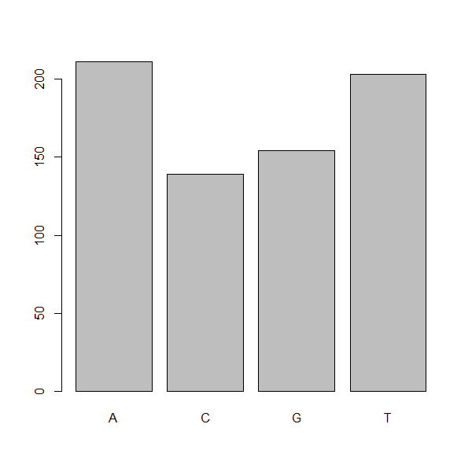
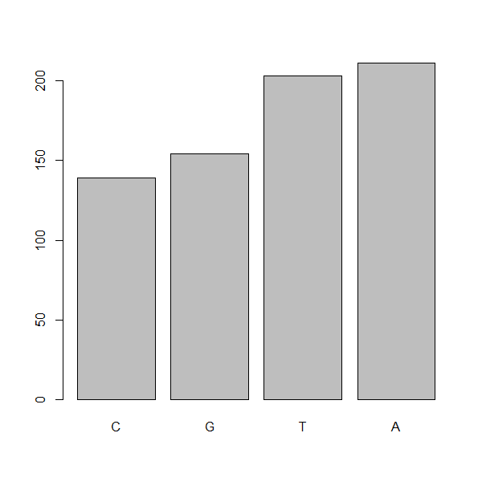

# Factors and Coercion

## Introducing factors

Factors are another major data structure that is important to know about. Factors can be thought of as vectors which are specialized for
categorical data. Given R's specialization for statistics, this make sense since
categorial and continuous variables are usually treated differently. Sometimes
you may want to have data treated as a factor, but in other cases, this may be
undesirable. Let's see the value of treating some of which are categorical in 
nature as factors. Let's take a look at just the alternate alleles, continuing on from our variants dataframe example. 

!!! r-project "r" 
  
    ```r
     
    # Recreate the variants dataframe and subset it, if you do not already have these objects in your environment:

    variants <- read.csv("https://raw.githubusercontent.com/GenomicsAotearoa/Introduction-to-R/refs/heads/main/combined_tidy_vcf.csv")
    subset_variants <- variants[, c(1:3, 6)]
    ```


!!! r-project "r"

    ```r
    # Extract the "ALT" column to a new object

    alt_alleles <- subset_variants$ALT
    ```

Let's look at the first few items in our factor using `head()`:

!!! r-project "r"

    ```r
    head(alt_alleles)
    ```

    ??? success "Output"

        ```
        [1] "G"         "T"         "T"         "CTTTTTTTT" "CCGCGC"    "T"
        ```

There are 801 alleles (one for each row). To simplify, lets look at just
the single-nucleotide alleles (SNPs). We can use some of the vector
indexing skills from the last episode.

!!! r-project "r"

    ```r
    alt_snps <- c(alt_alleles[alt_alleles=="A"],
                  alt_alleles[alt_alleles=="T"],
                  alt_alleles[alt_alleles=="G"],
                  alt_alleles[alt_alleles=="C"])
    ```

This leaves us with a vector of the 701 alternative alleles which were
single nucleotides. Right now, they are being treated a characters, but
we could treat them as categories of SNP. Doing this will enable some
nice features. For example, we can try to generate a plot of this
character vector as it is right now:

!!! r-project "r"

    ```r
    plot(alt_snps)
    ```

    ??? failure "Output"

        ```
        Error in plot.window(...) : need finite 'ylim' values
        In addition: Warning messages:
        1: In xy.coords(x, y, xlabel, ylabel, log) : NAs introduced by coercion
        2: In min(x) : no non-missing arguments to min; returning Inf
        3: In max(x) : no non-missing arguments to max; returning -Inf
        ```

Whoops! Though the `plot()` function will do its best to give us a quick
plot, it is unable to do so here. One way to fix this it to tell R to
treat the SNPs as categories (i.e., a factor vector); we will create a
new object to avoid confusion using the `factor()` function:

!!! r-project "r"

    ```r
    factor_snps <- factor(alt_snps)
    ```

Let's learn a little more about this new type of vector:

!!! r-project "r"

    ```r
    str(factor_snps)
    ```

??? success "Output"

    ```
     Factor w/ 4 levels "A","C","G","T": 1 1 1 1 1 1 1 1 1 1 ...
    ```

What we get back are the categories ("A","C","G","T") in our factor;
these are called "levels". **Levels are the different categories
contained in a factor**. By default, R will organize the levels in a
factor in alphabetical order. So the first level in this factor is "A".

For the sake of efficiency, R stores the content of a factor as a vector
of integers, which an integer is assigned to each of the possible
levels. Recall levels are assigned in alphabetical order. In this case,
the first item in our `factor_snps` object is "A", which happens to be
the 1st level of our factor, ordered alphabetically. This explains the
sequence of "1"s (`Factor w/ 4 levels"A","C","G","T": 1 1 1 1 1 1 1 1 1
1 ...`), since "A" is the first level and the first few items in our
factor are all "A"s.

We can see how many items in our vector fall into each category:

!!! r-project "r"

    ```r
    summary(factor_snps)
    ```

    ??? success "Output"

        ```
          A   C   G   T 
        211 139 154 203
        ```

As you can imagine, this is already useful when you want to generate a
tally.

!!! tip "Treating objects as categories without changing their mode"

    You don't have to make an object a factor to get the benefits of
    treating an object as a factor. See what happens when you use the
    `as.factor()` function on `factor_snps`. To generate a tally, you can
    sometimes also use the `table()` function; though sometimes you may
    need to combine both (i.e., `table(as.factor(object))`)

### Plotting and ordering factors

One of the most common uses for factors will be when you plot
categorical values. For example, suppose we want to know how many of our
variants had each possible SNP we could generate a plot:

!!! r-project "r"

    ```r
    plot(factor_snps)
    ```

    ??? success "Output"

        { width="600"}

This isn't a particularly pretty example of a plot but it works. We'll
be learning much more about creating nice, publication-quality graphics
later in this workshop.

If you recall, factors are ordered alphabetically. That might make
sense, but categories (e.g., "red", "blue", "green") often do not have
an intrinsic order. What if we wanted to order our plot according to the
numerical value (i.e., in descending order of SNP frequency)? We can
enforce an order on our factors:

!!! r-project "r"

    ```r
    ordered_factor_snps <- factor(
      factor_snps, 
      levels = names(sort(table(factor_snps)))
    )
    ```

Let's deconstruct this from the *inside out* (you can try each of these
commands to see why this works):

1.  We create a table of `factor_snps` to get the frequency of each SNP:
    `table(factor_snps)`
2.  We sort this table: `sort(table(factor_snps))`; use the
    `decreasing =` parameter for this function if you wanted to change
    from the default of FALSE
3.  Using the `names()` function gives us just the character names of the
    table sorted by frequencies:`names(sort(table(factor_snps)))`
4.  The `factor` function is what allows us to create a factor. We give
    it the `factor_snps` object as input, and use the `levels=`
    parameter to enforce the ordering of the levels.

Now we see our plot has be reordered:

!!! r-project "r"

    ```r
    plot(ordered_factor_snps)
    ```

    ??? success "Output"

        { width="600" }

Factors come in handy in many places when using R. Even using more
sophisticated plotting packages such as `ggplot2` will sometimes require
you to understand how to manipulate factors.


## Coercing values

Sometimes, it is possible that R will misinterpret the type of data represented
in a data frame, or store that data in a mode which prevents you from
operating on the data the way you wish. For example, a long list of gene names
isn't usually thought of as a categorical variable, the way that your
experimental condition (e.g., control, treatment) might be. More importantly,
some R packages you use to analyze your data may expect characters as input,
not factors. At other times (such as plotting or some statistical analyses) a
factor may be more appropriate. Ultimately, you should know how to change the
mode of an object.

First, its very important to recognize that coercion happens in R all the time.
This can be a good thing when R gets it right, or a bad thing when the result
is not what you expect. Consider:

!!! r-project "r"

    ```r
    snp_chromosomes <- c('3', '11', 'X', '6')
    typeof(snp_chromosomes)
    ```

    ??? success "Output"

        ```
        [1] "character"
        ```

Although there are several numbers in our vector, they are all in
quotes, so we have explicitly told R to consider them as characters.
However, even if we removed the quotes from the numbers, R would coerce
everything into a character:

!!! r-project "r"

    ```r
    snp_chromosomes_2 <- c(3, 11, 'X', 6)
    typeof(snp_chromosomes_2)
    snp_chromosomes_2[1]
    ```

    ??? success "Output"

        ```
        [1] "character"
        [1] "3"
        ```

We can use the `as.` functions to explicitly coerce values from one form
into another. Consider the following vector of characters, which all
happen to be valid numbers:

!!! r-project "r"

    ```r
    snp_positions_2 <- c("8762685", "66560624", "67545785", "154039662")
    typeof(snp_positions_2)
    snp_positions_2[1]
    ```

    ??? success "Output"

        ```
        [1] "character"
        [1] "8762685"
        ```

Now we can coerce `snp_positions_2` into a numeric mode using
`as.numeric()`:

!!! r-project "r"

    ```r
    snp_positions_2 <- as.numeric(snp_positions_2)
    typeof(snp_positions_2)
    snp_positions_2[1]
    ```

    ??? success "Output"

        ```
        [1] "double"
        [1] 8762685
        ```

Sometimes coercion is straight forward, but what would happen if we
tried using `as.numeric()` on `snp_chromosomes_2`

!!! r-project "r"

    ```r
    snp_chromosomes_2 <- as.numeric(snp_chromosomes_2)
    ```

    ??? success "Output"

        ```
        Warning message:
        NAs introduced by coercion
        ```

If we check, we will see that an `NA` value (R's default value for
missing data) has been introduced.

!!! r-project "r"

    ```r
    snp_chromosomes_2
    ```

    ??? success "Output"

        ```
        [1]  3 11 NA  6
        ```

Trouble can really start when we try to coerce a factor. For example,
when we try to coerce the `factor_snps` into a numeric mode look at the 
result: 

!!! r-project "r"

    ```r
    as.numeric(factor_snps)
    ```

??? success "Output"

    ```
      [1] 1 1 1 1 1 1 1 1 1 1 1 1 1 1 1 1 1 1 1 1 1 1 1 1 1 1 1
     [28] 1 1 1 1 1 1 1 1 1 1 1 1 1 1 1 1 1 1 1 1 1 1 1 1 1 1 1
     [55] 1 1 1 1 1 1 1 1 1 1 1 1 1 1 1 1 1 1 1 1 1 1 1 1 1 1 1
     [82] 1 1 1 1 1 1 1 1 1 1 1 1 1 1 1 1 1 1 1 1 1 1 1 1 1 1 1
    [109] 1 1 1 1 1 1 1 1 1 1 1 1 1 1 1 1 1 1 1 1 1 1 1 1 1 1 1
    [136] 1 1 1 1 1 1 1 1 1 1 1 1 1 1 1 1 1 1 1 1 1 1 1 1 1 1 1
    [163] 1 1 1 1 1 1 1 1 1 1 1 1 1 1 1 1 1 1 1 1 1 1 1 1 1 1 1
    [190] 1 1 1 1 1 1 1 1 1 1 1 1 1 1 1 1 1 1 1 1 1 1 4 4 4 4 4
    [217] 4 4 4 4 4 4 4 4 4 4 4 4 4 4 4 4 4 4 4 4 4 4 4 4 4 4 4
    [244] 4 4 4 4 4 4 4 4 4 4 4 4 4 4 4 4 4 4 4 4 4 4 4 4 4 4 4
    [271] 4 4 4 4 4 4 4 4 4 4 4 4 4 4 4 4 4 4 4 4 4 4 4 4 4 4 4
    [298] 4 4 4 4 4 4 4 4 4 4 4 4 4 4 4 4 4 4 4 4 4 4 4 4 4 4 4
    [325] 4 4 4 4 4 4 4 4 4 4 4 4 4 4 4 4 4 4 4 4 4 4 4 4 4 4 4
    [352] 4 4 4 4 4 4 4 4 4 4 4 4 4 4 4 4 4 4 4 4 4 4 4 4 4 4 4
    [379] 4 4 4 4 4 4 4 4 4 4 4 4 4 4 4 4 4 4 4 4 4 4 4 4 4 4 4
    [406] 4 4 4 4 4 4 4 4 4 3 3 3 3 3 3 3 3 3 3 3 3 3 3 3 3 3 3
    [433] 3 3 3 3 3 3 3 3 3 3 3 3 3 3 3 3 3 3 3 3 3 3 3 3 3 3 3
    [460] 3 3 3 3 3 3 3 3 3 3 3 3 3 3 3 3 3 3 3 3 3 3 3 3 3 3 3
    [487] 3 3 3 3 3 3 3 3 3 3 3 3 3 3 3 3 3 3 3 3 3 3 3 3 3 3 3
    [514] 3 3 3 3 3 3 3 3 3 3 3 3 3 3 3 3 3 3 3 3 3 3 3 3 3 3 3
    [541] 3 3 3 3 3 3 3 3 3 3 3 3 3 3 3 3 3 3 3 3 3 3 3 3 3 3 3
    [568] 3 2 2 2 2 2 2 2 2 2 2 2 2 2 2 2 2 2 2 2 2 2 2 2 2 2 2
    [595] 2 2 2 2 2 2 2 2 2 2 2 2 2 2 2 2 2 2 2 2 2 2 2 2 2 2 2
    [622] 2 2 2 2 2 2 2 2 2 2 2 2 2 2 2 2 2 2 2 2 2 2 2 2 2 2 2
    [649] 2 2 2 2 2 2 2 2 2 2 2 2 2 2 2 2 2 2 2 2 2 2 2 2 2 2 2
    [676] 2 2 2 2 2 2 2 2 2 2 2 2 2 2 2 2 2 2 2 2 2 2 2 2 2 2 2
    [703] 2 2 2 2 2 
    ```

Strangely, it works! Almost. Instead of giving an error message, R
returns numeric values, which in this case are the integers assigned to
the levels in this factor. This kind of behavior can lead to
hard-to-find bugs, for example when we do have numbers in a factor, and
we get numbers from a coercion. If we don't look carefully, we may not
notice a problem.

If you need to coerce an entire column you can overwrite it using an
expression like this one:

!!! r-project "r"

    ```r
    # Make the 'sample_id' column a factor type column
    variants$sample_id <- as.factor(variants$sample_id)

    # check the structure of the column
    str(variants$sample_id)
    ```

    ??? success "Output"

        ```
        Factor w/ 3 levels "SRR2584863","SRR2584866",..: 1 1 1 1 1 1 1 1 1 1 ...
        ```

### Lesson summary: Data coercion

Lets summarize this section on coercion with a few take home messages.

- When you explicitly coerce one data type into another (this is known as
  **explicit coercion**), be careful to check the result. Ideally, you should 
  try to see if its possible to avoid steps in your analysis that force you to
  coerce.
- R will sometimes coerce without you asking for it. This is called
  (appropriately) **implicit coercion**. For example when we tried to create
  a vector with multiple data types, R chose one type through implicit
  coercion.
- Check the structure (`str()`) of your data before working with them!


!!! tip "`StringsAsFactors`"

    Prior to R 4.0 when importing a data frame using any one of the `read.table()`
    functions such as `read.csv()` , the argument `StringsAsFactors` was by
    default
    set to true TRUE. Setting it to FALSE will treat any non-numeric column to
    a character type. `read.csv()` documentation, you will also see you can
    explicitly type your columns using the `colClasses` argument. Other R packages
    (such as the Tidyverse `readr`) don't have this particular conversion issue,
    but many packages will still try to guess a data type.


