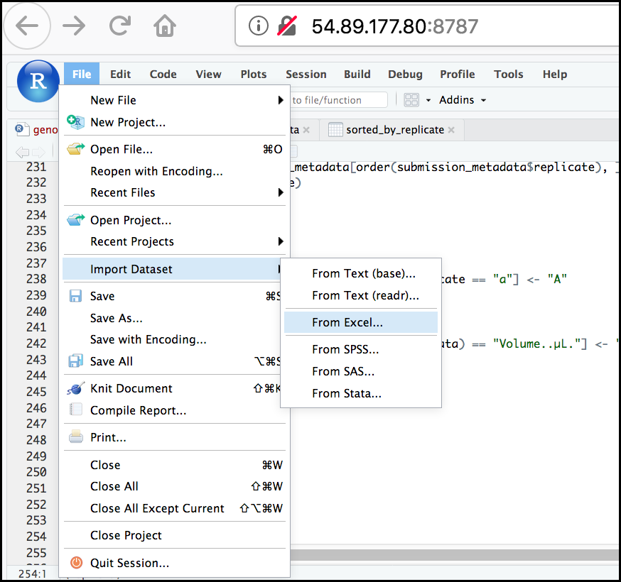
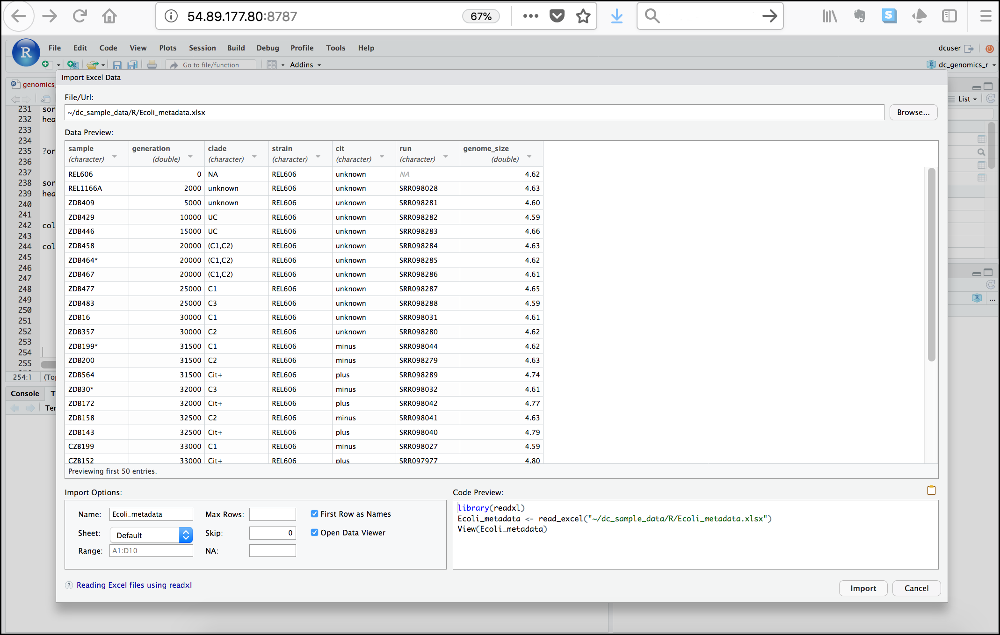

# Importing data from Excel

Excel is one of the most common formats, so we need to discuss how to
make these files play nicely with R. The simplest way to import data
from Excel is to **save your Excel file in `.csv` format**. You can then
import into R right away. Sometimes you may not be able to do this
(imagine you have data in 300 Excel files, are you going to open and
export all of them?).

One common R package (a set of code with features you can download and
add to your R installation) is the [readxl 
package](https://CRAN.R-project.org/package=readxl) which can open and
import Excel files. Rather than addressing package installation this
second (we'll discuss this soon!), we can take advantage of RStudio's
import feature which integrates this package. 

!!! bell "`readxl`-RStudio integration" 

    This feature is only available on RStudio version 1.0.44 or later.

First, [go to this link](https://github.com/GenomicsAotearoa/Introduction-to-R/blob/main/docs/Ecoli_metadata.xlsx) and click the download button to download the **Ecoli_metadata.xlsx** file from our Github.   

In the RStudio menu go to **File**, select **Import Dataset**,
and choose **From Excel...** (notice there are several other options you
can explore).

{ width="600" }

Next, under **File/Url:** click the <KBD>Browse</KBD>
button and navigate to the **Ecoli_metadata.xlsx** file located on your computer. You should now see a preview of the
data to be imported:

{ width="1200" }

Notice that you have the option to change the data type of each variable
by clicking arrow (drop-down menu) next to each column title. Under
**Import Options** you may also rename the data, choose a different
sheet to import, and choose how you will handle headers and skipped
rows. Under **Code Preview** you can see the code that will be used to
import this file. We could have written this code and imported the Excel
file without the RStudio import function, but now you can choose your
preference.

In this exercise, we will leave the name of the data frame as
**Ecoli_metadata**, and there are no other options we need to adjust.
Click the <KBD>Import</KBD> button to import the data.

Finally, let's check the first few lines of the `Ecoli_metadata` data
frame:

!!! r-project "r"

    ```r
    head(Ecoli_metadata)
    ```

    ??? success "Output"

        ```
        # A tibble: 6 × 7
          sample   generation clade   strain cit     run       genome_size
          <chr>         <dbl> <chr>   <chr>  <chr>   <chr>           <dbl>
        1 REL606            0 NA      REL606 unknown NA               4.62
        2 REL1166A       2000 unknown REL606 unknown SRR098028        4.63
        3 ZDB409         5000 unknown REL606 unknown SRR098281        4.6 
        4 ZDB429        10000 UC      REL606 unknown SRR098282        4.59
        5 ZDB446        15000 UC      REL606 unknown SRR098283        4.66
        6 ZDB458        20000 (C1,C2) REL606 unknown SRR098284        4.63
        ```

The type of this object is **tibble**, a type of data frame we will talk
more about in the [`dplyr` section](appendix/03A-dplyr.md). If you needed a true 
R data frame you could coerce with `as.data.frame()`.

## Review exercises

!!! question "Exercise: Putting it all together - data frames"

    **Using the `Ecoli_metadata` data frame created above, answer the following questions**

    A)  What are the dimensions (# rows, # columns) of the data frame?

    B)  What are categories are there in the `cit` column? *hint*: treat column as factor
    
    C)  How many of each of the `cit` categories are there?

    D)  What is the genome size for the 7th observation in this data set?

    E)  What is the median value of the variable `genome_size`?
    
    F)  Rename the column `sample` to `sample_id`.
    
    G)  Create a new column named `genome_size_bp` and set it equal to the genome_size multiplied by 1,000,000.

    H)  Save the edited `Ecoli_metadata` data frame as "exercise_solution.csv" in your current working directory.

    ??? success "Solution"

        A)

        !!! r-project "r"

            ```r
            dim(Ecoli_metadata)
            ```
        
            ??? success "Output"

                ```
                [1] 30  7
                ```
        
        B)

        !!! r-project "r"

            ```r
            levels(as.factor(Ecoli_metadata$cit))
            ```
        
            ??? success "Output"

                ```
                [1] "minus"   "plus"    "unknown"
                ```

        C)

        !!! r-project "r"

            ```r
            table(as.factor(Ecoli_metadata$cit))
            ```
        
            ??? success "Output"

                ```
                minus    plus unknown 
                    9       9      12 
                ```

        D)

        !!! r-project "r"

            ```r
            Ecoli_metadata[7, 7]
            ```
        
            ??? success "Output"

                ```
                # A tibble: 1 × 1
                  genome_size
                        <dbl>
                1        4.62 
                ```

        E)

        !!! r-project "r"

            ```r
            median(Ecoli_metadata$genome_size)
            ```
        
            ??? success "Output"

                ```
                [1] 4.625
                ```

        F)

        !!! r-project "r"

            ```r
            colnames(Ecoli_metadata)[colnames(Ecoli_metadata) == "sample"] <- "sample_id"

            # Check the column names
            colnames(Ecoli_metadata)
            ```

            ??? success "Output"

                ```
                [1] "sample_id"   "generation"  "clade"       "strain"     
                [5] "cit"         "run"         "genome_size"
                ```
        
        G)

        !!! r-project "r"

            ```r
            Ecoli_metadata$genome_size_bp <- Ecoli_metadata$genome_size * 1000000

            # Check the first few rows
            head(Ecoli_metadata)
            ```

            ??? success "Output"

                ```
                # A tibble: 6 × 8
                  sample_id generation clade   strain cit     run       genome_size genome_size_bp
                  <chr>          <dbl> <chr>   <chr>  <chr>   <chr>           <dbl>          <dbl>
                1 REL606             0 NA      REL606 unknown NA               4.62        4620000
                2 REL1166A        2000 unknown REL606 unknown SRR098028        4.63        4630000
                3 ZDB409          5000 unknown REL606 unknown SRR098281        4.6         4600000
                4 ZDB429         10000 UC      REL606 unknown SRR098282        4.59        4590000
                5 ZDB446         15000 UC      REL606 unknown SRR098283        4.66        4660000
                6 ZDB458         20000 (C1,C2) REL606 unknown SRR098284        4.63        4630000
                ```

        H)

        !!! r-project "r"

            ```r            
            write.csv(Ecoli_metadata, file = "exercise_solution.csv")
            ```

            Check the Files tab on the bottom-right panel to see if the file is 
            there.


!!! question "Exercise: Review the arguments of the `read.csv()` function"

    **Before using the `read.csv()` function, use R's help feature to
    answer the following questions**.

    *Hint*: Entering '?' before the function name and then running that
    line will bring up the help documentation. Also, when reading this
    particular help be careful to pay attention to the 'read.csv'
    expression under the 'Usage' heading. Other answers will be in the
    'Arguments' heading.

    A)  What is the default parameter for 'header' in the `read.csv()`
        function?

    B)  What argument would you have to change to read a file that was
        delimited by semicolons (;) rather than commas?
        
    C)  What argument would you have to change to read file in which
        numbers used commas for decimal separation (i.e., 1,00)?
        
    D)  What argument would you have to change to read in only the first
        10,000 rows of a very large file?

    ??? success "Solution"

        A)  The `read.csv()` function has the argument 'header' set to `TRUE`
            by default. This means the function always assumes the first row
            is header information, (i.e., column names)
            
        B)  The `read.csv()` function has the argument 'sep' set to ",".
            This means the function assumes commas are used as delimiters,
            as you would expect. Changing this parameter (e.g., `sep=";"`)
            would tell R to interpret semicolons as delimiters.
            
        C)  Although it is not listed in the `read.csv()` usage,
            `read.csv()` is a "version" of the function `read.table()` and
            accepts all its arguments. If you set `dec=","` you could change
            the decimal operator. We'd probably assume the delimiter is some
            other character.
            
        D)  You can set `nrow` to a numeric value (e.g., `nrow=10000`) to
            choose how many rows of a file you read in. This may be useful
            for very large files where not all the data is needed to test
            some data cleaning steps you are applying.

        Hopefully, this exercise gets you thinking about using the provided
        help documentation in R. There are many arguments that exist, but
        which we wont have time to cover. 
